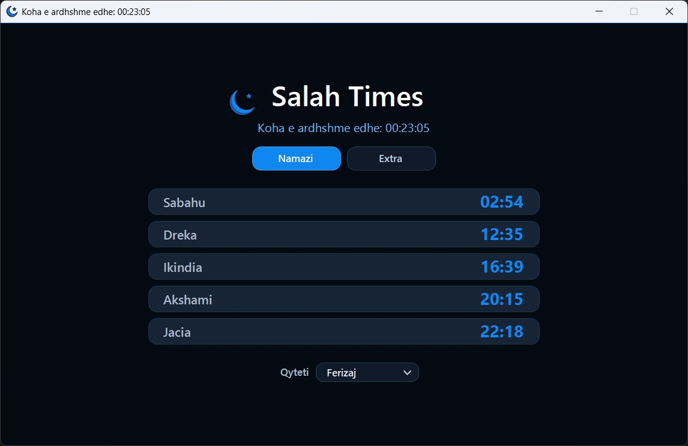
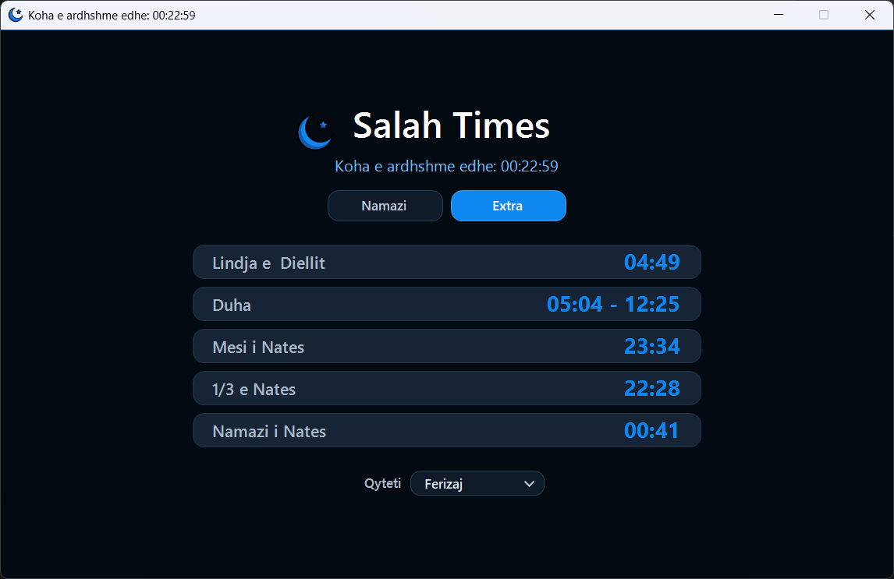

# Salah Times

A simple Windows app for daily salah times with a countdown, extra night times, and city-based minute adjustments.

## Screenshots

## Features

- Prayer times for the day
- Countdown to the next prayer
- Extra times: sunrise, Duha, Mesi i Nates, 1/3 e Nates, and Namazi i Nates
- City selector with saved preference
- Portable release zip for Windows

## Download

Download the latest `.zip` from GitHub Releases, extract it, and run `Salah Times.exe`.

Requires Windows with .NET Framework 4.8.
